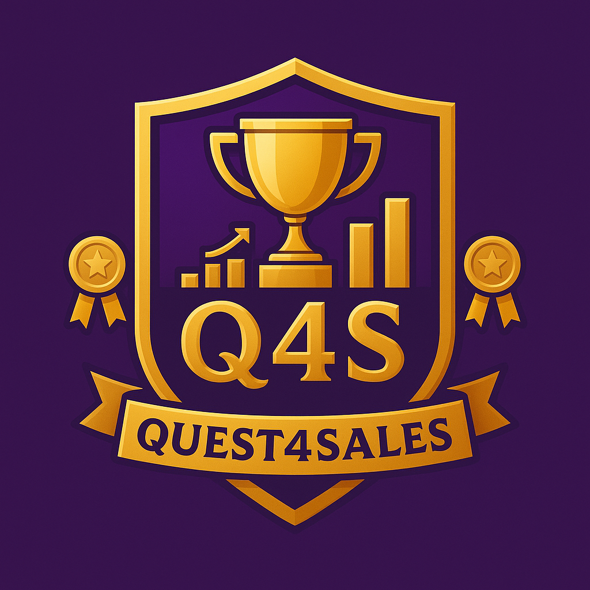

# Quest4Sales 
**Programação Web – 2025.2**

## Descrição
O **Quest4Sales (Q4S)** é um aplicativo web **gamificado de rankings de vendas**. Ele transforma metas de vendas em uma experiência divertida, com **pontos, medalhas e classificação em tempo real**. A ideia é motivar equipes a baterem suas metas de forma **competitiva e saudável**, com um visual inspirado em RPG e elementos de gamificação.

## Funcionalidades
- Ranking de vendas da equipe em tempo real.
- Sistema de pontos e medalhas.
- Interface gamificada com estilo RPG.
- Motivação e engajamento da equipe de vendas.